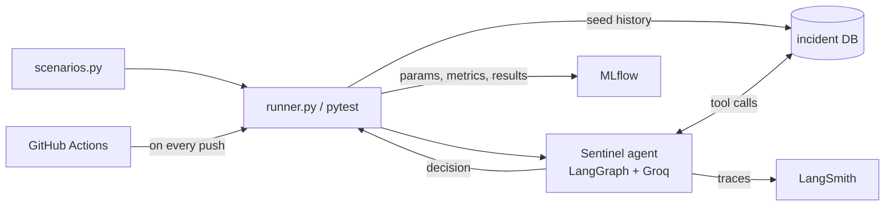

# AgentLens

**Evaluation and LLMOps pipeline for AI agents.** AgentLens scores an agent's decisions against a set of scripted scenarios, tracks every run in MLflow, traces each agent step in LangSmith, and re-runs the whole suite in CI on every push.

It is built to evaluate [Sentinel](https://github.com/ahmed-askri/Sentinel), a LangGraph agent that reasons over computer-vision detection events (smoking, intrusion, violence, unauthorized access) and decides whether to escalate to security, log a likely false alarm, or flag the event for human review.


## What it does

| Layer | Tool | What you get |
|---|---|---|
| Evaluation | Python + pytest | 22 scripted scenarios. 17 have a single correct decision and are scored; 5 are ambiguous and are logged for review, not graded. |
| Experiment tracking | MLflow | One run per evaluation: model, temperature, pass/fail counts, pass rate and a per-scenario results file. |
| Tracing | LangSmith | One named trace per scenario showing each LLM call, tool call and the final decision. |
| CI | GitHub Actions | The scored scenarios run on every push. A wrong decision fails the build. |

## Architecture



For each scenario the runner clears the incident database, seeds the history the scenario describes (for example "two past false alarms at this camera"), sends Sentinel a detection event, and reads which tool the agent called:

- `escalate_to_security` is scored as `escalate`
- `flag_for_human_review` is scored as `human_review`
- no escalation tool is scored as `no_escalate`

That outcome is compared with the expected decision for the scenario.

## Results

Latest run on `openai/gpt-oss-20b` (Groq), `temperature=0`:

- **17 / 17** scored scenarios correct
- **5** ambiguous scenarios flagged for human review (not graded)
- **0** errors


### What the tracking surfaced

- **A flaky scenario.** At the default temperature, `repeated_false_alarm_smoking` failed once across a handful of runs: the agent chose `human_review` where the rules say `no_escalate`. Setting `temperature=0` in Sentinel made the full suite pass consistently. A single green run would not have shown this; repeated runs and per-scenario results did.
- **Latency spikes.** Most scenarios take 1 to 3 seconds, but a few took 7 to 30 seconds in LangSmith. This is most likely Groq free-tier rate limiting and retries rather than slower reasoning, which is why the runner pauses between scenarios.

## Project structure

```
AgentLens/
├── eval/
│   ├── runner.py          # runs all scenarios, logs to MLflow
│   ├── test_sentinel.py   # pytest version of the scored scenarios (used in CI)
│   ├── env_setup.py       # loads .env and locates the Sentinel repo
│   ├── seed.py            # seeds incident history for a scenario
│   └── smoke_test.py
├── scenarios/
│   └── scenarios.py       # the scenario set and expected decisions
├── docs/                  # screenshots used in this README
├── .github/workflows/     # CI pipeline
└── .env.example           # keys the project expects
```

## Setup

You need Python 3.11+ and both repositories side by side:

```powershell
git clone https://github.com/ahmed-askri/AgentLens.git
git clone https://github.com/ahmed-askri/Sentinel.git
cd AgentLens
python -m venv .venv
.venv\Scripts\activate
pip install -r ..\Sentinel\requirements.txt pytest python-dotenv
copy .env.example .env
```

Then edit `.env`:

```
GROQ_API_KEY=            # console.groq.com
LANGSMITH_TRACING=true
LANGSMITH_API_KEY=       # smith.langchain.com (use a personal access token)
LANGSMITH_PROJECT=AgentLens
# SENTINEL_PATH=         # only if Sentinel is not next to AgentLens
```

Sentinel is found automatically at `../Sentinel` or `./Sentinel`.

## Usage

Run the scored scenarios as tests:

```powershell
python -m pytest eval/test_sentinel.py -v
```

Run the full evaluation, including the ambiguous scenarios, and log it to MLflow:

```powershell
python eval/runner.py
python -m mlflow ui --backend-store-uri sqlite:///mlflow.db
```

Open http://localhost:5000 and select the **AgentLens** experiment. Traces appear in LangSmith under the **AgentLens** project when tracing is enabled.

## Limitations

- **Small, hand-written scenario set.** The 22 scenarios were written alongside the agent, so 17/17 shows the agent follows its own rules, not that it generalizes to real surveillance data.
- **LLM nondeterminism.** `temperature=0` reduces it but does not remove it. Repeating each scenario several times and tracking a per-scenario pass rate is the next step.
- **Rate limits.** The Groq free tier slows long runs.
- **MLflow run duration** only covers the final logging step, not the evaluation loop.

## Out of scope

Continuous deployment. AgentLens evaluates an agent and gates changes through CI; it does not deploy anything. Deployment of Sentinel belongs in Sentinel's own pipeline, which could require this evaluation suite to pass before releasing.
