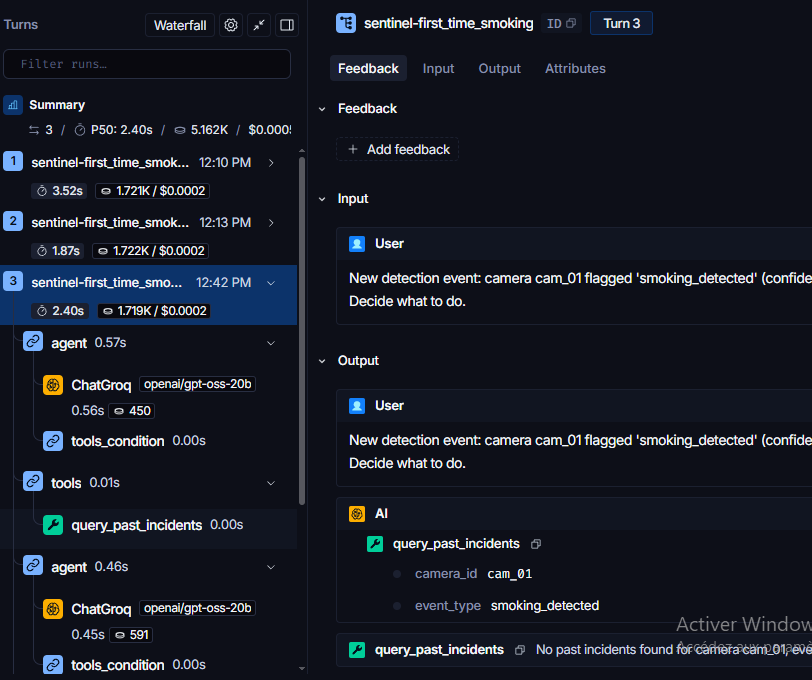
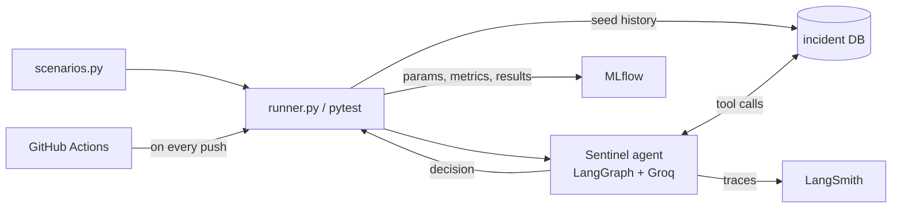
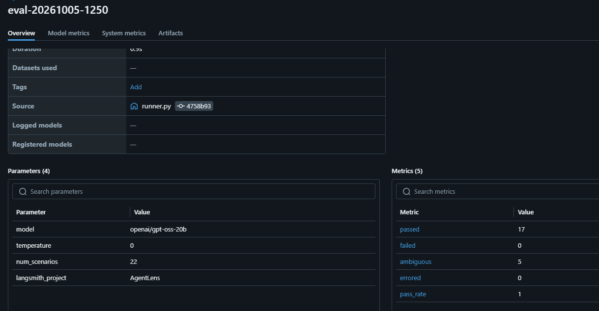
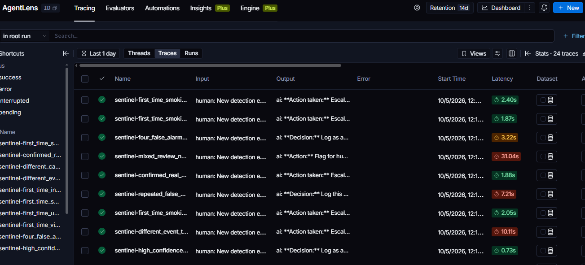

# 🔍 AgentLens

**An evaluation and LLMOps pipeline for AI agents.** Scripted scenarios score an agent's decisions, MLflow tracks every run, LangSmith traces every step, and GitHub Actions re-runs the suite on every push.

> 🛡️ Companion project to [Sentinel](https://github.com/ahmed-askri/Sentinel), the agentic reasoning layer for video surveillance that AgentLens evaluates.

     [](https://github.com/ahmed-askri/AgentLens/actions)



## 📋 Table of Contents

- [🎯 The Problem](#-the-problem)
- [⚙️ What AgentLens Does](#️-what-agentlens-does)
- [🏗️ Architecture](#️-architecture)
- [🔄 How It Works](#-how-it-works)
- [🧪 The Scenario Suite](#-the-scenario-suite)
- [📊 Results](#-results)
- [🧠 Design Decisions](#-design-decisions)
- [🚀 Getting Started](#-getting-started)
- [📁 Project Structure](#-project-structure)
- [📸 See It In Action](#-see-it-in-action)
- [⚠️ Limitations](#️-limitations)
- [🔮 What I'd Build Next](#-what-id-build-next)

## 🎯 The Problem

An agent that works in one demo tells you almost nothing. Language models are nondeterministic, prompts get edited, models get swapped, and any of those changes can quietly break a behavior that worked yesterday. "It looked right when I tried it" is not a test.

Agents need what ordinary software already has: a regression suite that runs automatically, a record of how scores moved between changes, and a way to open any single failure and see exactly what the agent did. AgentLens is that for Sentinel.

## ⚙️ What AgentLens Does

- 🧪 **Scores decisions, not wording.** Each scenario has an expected decision. The runner reads which tool the agent actually called and compares it, so a pass or fail does not depend on how the model phrased its answer.
- 🔒 **Isolates every scenario.** The incident database is cleared and re-seeded for each one, and each gets its own conversation thread, so one scenario cannot leak history into the next.
- 📈 **Tracks every run in MLflow.** Model, temperature, pass, fail, ambiguous and error counts, pass rate, and a per-scenario results file, all comparable across runs.
- 🔭 **Traces every step in LangSmith.** One named trace per scenario shows each LLM call, each tool call and its result, token counts and cost.
- 🚦 **Gates changes in CI.** The scored scenarios run as pytest tests on every push, so a wrong decision turns the build red before a change lands.
- 🙋 **Separates ambiguous cases.** Scenarios with no single right answer are logged for review instead of graded, so they never produce false failures.

## 🏗️ Architecture



The test file and the runner share the same helper functions (`clear_db`, `build_prompt`, `determine_decision`), so a scenario is scored identically in CI and in a full MLflow-tracked run.

## 🔄 How It Works

1. 📥 **Load a scenario.** It defines a camera, an event type, a confidence, a timestamp, optional history and an expected decision.
2. 🌱 **Seed the world.** The incident database is cleared, then filled with the history the scenario describes, such as "three past false alarms at this camera".
3. 🤖 **Run the agent.** A detection event goes to Sentinel's graph, which queries history and decides.
4. 🔍 **Read the decision from the tool calls.**
   - `escalate_to_security` becomes `escalate`
   - `flag_for_human_review` becomes `human_review`
   - neither becomes `no_escalate`
5. ✅ **Score it.** PASS, FAIL, or REVIEW for ambiguous scenarios.
6. 💾 **Log it.** One MLflow run per evaluation, plus a LangSmith trace per scenario.

Console output from a real run:

```
ID                               EXPECTED   ACTUAL     RESULT
---------------------------------------------------------------------------
first_time_smoking               escalate   escalate   PASS
repeated_false_alarm_smoking     no_escalate no_escalate PASS
three_false_alarms               no_escalate no_escalate PASS
one_confirmed_real               escalate   escalate   PASS
mixed_history_balanced           AMBIGUOUS  human_review REVIEW
different_camera_no_leak         escalate   escalate   PASS
---------------------------------------------------------------------------
Score: 17/17 correct  (5 flagged for review, 0 errored)
```

## 🧪 The Scenario Suite

22 scenarios: 17 scored, 5 ambiguous.

| Category | Scenarios | Expected |
|---|---|---|
| First sighting, no history | `first_time_smoking`, `first_time_intrusion`, `first_time_violence`, `first_time_unauthorized_access`, `first_time_smoking_cam16` | escalate |
| Clean pattern of false alarms | `repeated_false_alarm_smoking`, `repeated_false_alarm_intrusion`, `repeated_false_alarm_violence`, `three_false_alarms`, `four_false_alarms_edge` | no_escalate |
| Confirmed real incidents in history | `one_confirmed_real`, `two_confirmed_real`, `confirmed_real_unauthorized_access` | escalate |
| History must not leak | `different_camera_no_leak`, `different_event_type_same_camera` | escalate |
| Confidence edge cases | `low_confidence_no_history` (escalate), `high_confidence_false_alarm_history` (no_escalate) | as listed |
| Ambiguous, logged not graded | `real_incident_mixed_with_false`, `mixed_history_balanced`, `single_false_alarm_only`, `unusual_factor_overrides_pattern`, `mixed_review_no_real_yet` | human review |

The two "must not leak" scenarios matter most: they check that one camera's false-alarm history never suppresses an alert at another camera, or for a different event type.

## 📊 Results

Latest run, `openai/gpt-oss-20b` on Groq, `temperature=0`:

| Metric | Value |
|---|---|
| Scored scenarios correct | **17 / 17** |
| Ambiguous, flagged for review | 5 |
| Errors | 0 |
| Pass rate | 1.0 |



### 🔎 What the tracking surfaced

- **A flaky scenario.** At the default temperature, `repeated_false_alarm_smoking` failed once across a handful of runs. The agent chose `human_review` where the policy says `no_escalate`. Setting `temperature=0` in Sentinel made the suite pass consistently. A single green run would never have shown this.
- **Latency spikes.** Most scenarios take 1 to 3 seconds, but a few took 7 to 30 seconds in LangSmith. This is most likely Groq free-tier rate limiting and retries rather than slow reasoning, which is why the runner pauses between scenarios.
- **An ambiguous case that was not ambiguous to the agent.** On `single_false_alarm_only`, the agent chose `no_escalate` while the other four ambiguous scenarios went to `human_review`. One past false alarm is thin evidence, so this is worth a human look. That is the point of logging these cases instead of grading them.

## 🧠 Design Decisions

**Why score the tool call and not the text?** The decision is an action, not a sentence. Reading which tool the agent called is deterministic, so two different phrasings of the same decision score the same.

**Why not grade the ambiguous scenarios?** Forcing a single right answer onto a genuinely mixed history would make the suite fail for the wrong reasons. They are logged and reviewed by a person instead.

**Why `temperature=0`?** Evaluation is only useful if a failure means something changed. Removing sampling noise makes a red build point at a real regression.

**Why clear and re-seed the database for every scenario?** Shared state between scenarios would make results depend on run order. Each scenario starts from exactly the history it describes.

**Why MLflow on SQLite?** It needs no server, the whole experiment history is a single file, and runs stay comparable across code changes.

**Why a shared helper module for tests and runner?** A scenario must score the same way in CI as in a full tracked run. One implementation guarantees that.

## 🚀 Getting Started

You need Python 3.11+ and both repositories side by side:

```powershell
git clone https://github.com/ahmed-askri/AgentLens.git
git clone https://github.com/ahmed-askri/Sentinel.git
cd AgentLens
python -m venv .venv
.venv\Scripts\activate
pip install -r ..\Sentinel\requirements.txt pytest python-dotenv
copy .env.example .env
```

Edit `.env`:

```
GROQ_API_KEY=            # free at console.groq.com
LANGSMITH_TRACING=true
LANGSMITH_API_KEY=       # smith.langchain.com, use a personal access token
LANGSMITH_PROJECT=AgentLens
# SENTINEL_PATH=         # only if Sentinel is not next to AgentLens
```

Sentinel is found automatically at `../Sentinel` or `./Sentinel`.

**Run the scored scenarios as tests:**

```powershell
python -m pytest eval/test_sentinel.py -v
```

**Run the full evaluation and log it to MLflow:**

```powershell
python eval/runner.py
python -m mlflow ui --backend-store-uri sqlite:///mlflow.db
```

Open http://localhost:5000 and select the **AgentLens** experiment. Traces appear in LangSmith under the **AgentLens** project.

## 📁 Project Structure

```
AgentLens/
├── eval/
│   ├── runner.py          # runs every scenario, scores it, logs to MLflow
│   ├── test_sentinel.py   # pytest version of the scored scenarios (used in CI)
│   ├── env_setup.py       # loads .env and locates the Sentinel repo
│   ├── seed.py            # seeds incident history for a scenario
│   └── smoke_test.py
├── scenarios/
│   └── scenarios.py       # scenario set and expected decisions
├── docs/                  # screenshots used in this README
├── .github/workflows/     # CI pipeline
└── .env.example           # keys the project expects
```

## 📸 See It In Action

One trace per scenario, named so you can find it. The expanded trace shows the full agent loop: model call, history lookup, second model call, decision.



## ⚠️ Limitations

- **Small, hand-written scenario set.** The 22 scenarios were written alongside the agent, so 17/17 shows the agent follows its own policy, not that it generalizes to real surveillance data.
- **Rule-based scoring only.** It checks what the agent decided, not whether its reasoning was sound.
- **LLM nondeterminism.** `temperature=0` reduces it but does not remove it.
- **Tied to Sentinel.** The runner imports Sentinel's graph, tools and database directly, so it evaluates Sentinel and not an arbitrary agent.
- **Rate limits.** The Groq free tier slows long runs.

## 🔮 What I'd Build Next

- 🔁 **Repeat each scenario N times** and log a per-scenario pass rate to MLflow, turning "passed once" into "passes 9 of 10".
- ⚖️ **LLM-as-judge scoring** of the agent's reasoning, not only its final action.
- 🔌 **An adapter layer** so other agents can plug in: one function per agent that runs a scenario and returns a decision, with the tool-to-decision mapping in config.
- 🚦 **A score threshold in CI**, so a small pass-rate drop fails the build even when no single scenario flips.

---

Built by Ahmed Askri, Computer Science Engineering student, ENSI Tunisia.
